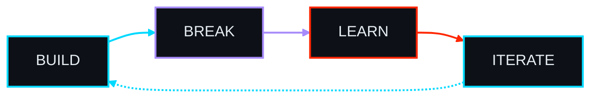

 

  

 

 

## `<` PROFILE `/>`

Computer Science & Engineering graduate building modern full-stack applications and AI-powered systems — from responsive interfaces and backend APIs to LLM pipelines, retrieval systems, and workflow automation.

Engineering interests sit at the intersection of **AI Engineering**, **Software Architecture**, **Automation**, and **Developer Experience**.

 

## `<` ENGINEERING FOCUS `/>`

### ⚡ FULL-STACK · 🧠 AI ENGINEERING · ⚙️ AUTOMATION

 

<table>
<tr>
<td align="center" width="33%">

**⚡ FULL-STACK**

Modern Web Applications  
Backend Systems & REST APIs  
Scalable Architecture

</td>

<td align="center" width="33%">

**🧠 AI ENGINEERING**

LLM Applications  
RAG Pipelines & AI Agents  
Semantic Search

</td>

<td align="center" width="33%">

**⚙️ AUTOMATION**

AI Workflows  
Tool Calling & API Integration  
Workflow Orchestration

</td>
</tr>
</table>

 

## `<` TECHNOLOGY `/>`

 

**LANGUAGES**

  

**FRONTEND & BACKEND**

  

**AI, DATA & INFRASTRUCTURE**

  

**TOOLS & PLATFORMS**

  

`n8n` · `Prisma` · `LiveKit` · `LLMs`

 

## `<` GITHUB ACTIVITY `/>`

 

  

  

 

## `<` PROBLEM SOLVING `/>`

 

 

## `<` ENGINEERING MINDSET `/>`

**Design for clarity. Build for reliability. Learn continuously.**

 

## `<` ✍️ RANDOM DEV QUOTE `/>`

 

 

## `<` LET'S CONNECT `/>`

 

Building something around **AI, software, or developer tools?**

  

  

Designed to evolve · Built to solve · Always learning

  

 

---
